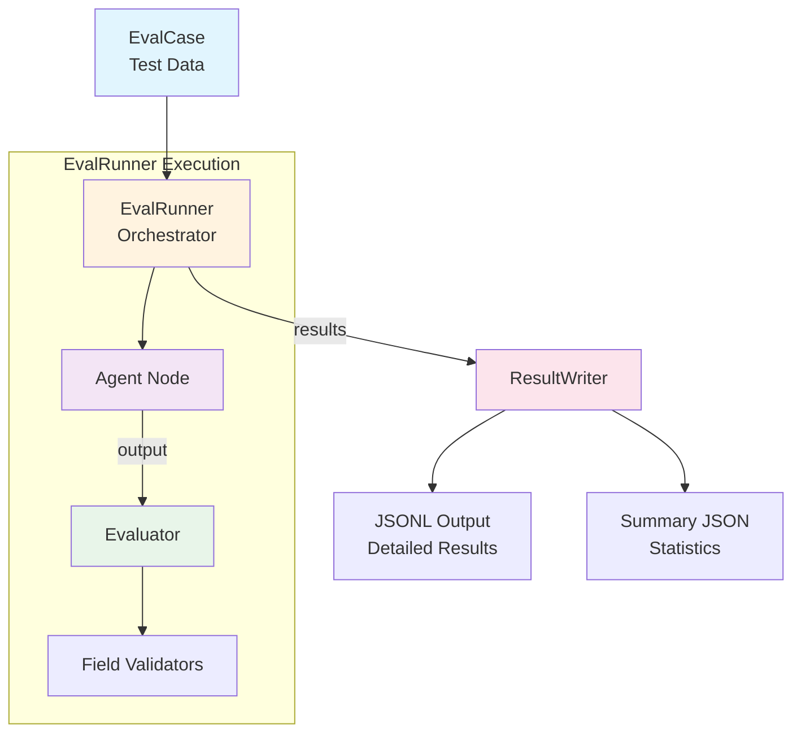

# Evaluation Framework

A type-safe, composable evaluation framework for testing LLM-based agent nodes with precise validation control.

## Table of Contents

1. [Overview](#overview)
2. [Architecture](#architecture)
3. [Core Components](#core-components)
4. [Field Validators - Precision Validation](#field-validators---precision-validation)
5. [Usage Guide](#usage-guide)
6. [Results & Analysis](#results--analysis)
7. [Patterns & Best Practices](#patterns--best-practices)
8. [Migration & Integration](#migration--integration)
9. [Examples](#examples)

## Overview

This evaluation framework provides a structured approach to testing LLM-based agents with:

- **Type Safety**: The framework provides full Pydantic model support for inputs and outputs, ensuring type correctness throughout the evaluation pipeline.
- **Composable Validation**: You can mix and match validators to achieve precise control over what passes and what fails.
- **Clear Results**: The framework generates detailed JSONL output that includes costs, timing metrics, and specific failure reasons for debugging.
- **Flexible Strategies**: The validation system supports everything from exact matching to semantic validation using LLM-as-Judge.

### When to Use This Framework

Use this framework when you need:
- Systematic testing of agent behavior across many cases to ensure consistency and reliability.
- Fine-grained control over what constitutes a "pass" through field-level validation rules.
- Cost and performance tracking for LLM calls to monitor and optimize expenses.
- Reproducible evaluation results with detailed logging for debugging and analysis.

### Key Principles

1. **Explicit over Implicit**: The framework requires clear validation rules rather than relying on hidden assumptions.
2. **Composability**: You can build complex validations by combining simple primitive validators.
3. **Observability**: Every decision and result is logged for complete transparency into the evaluation process.
4. **Flexibility**: The framework supports both strict and fuzzy matching depending on your testing needs.

## Architecture



### Data Flow

1. **EvalCase** defines input, expected output, and validation rules.
2. **EvalRunner** executes cases against the agent, handling retries and batching.
3. **Agent Node** processes input and returns output.
4. **Evaluator** applies validation rules to determine pass/fail.
5. **ResultWriter** persists results to disk with metrics.
6. **Output** includes detailed JSONL logs and summary statistics.

## Core Components

### EvalCase

The fundamental unit of testing. Each case specifies:

```python
class EvalCase(BaseModel, Generic[TInput, TOutput]):
    name: str                                           # Unique identifier
    input_data: TInput                                 # Typed input for agent
    expected_output: TOutput                           # Documentation/fallback validation
    field_validations: Optional[Dict[str, Any]]        # Field-level validation rules (including Criteria for semantic)
    description: Optional[str]                         # Human-readable description
```

**Key Points:**
- The `expected_output` field serves as documentation and provides a fallback for equality checking when no field validations are specified.
- The `field_validations` dictionary provides fine-grained control over specific fields using custom validators, including `Criteria` for semantic evaluation.
- The framework prioritizes field validations over equality check for maximum control and flexibility.

### EvalRunner

Orchestrates test execution with production-ready features:

```python
runner = EvalRunner(
    agent_class=YourAgent,
    llm_client=client,
    save_results=True,              # Enable result persistence
    max_retries=3,                  # Retry on rate limits
    batch_delay_seconds=5.0,        # Delay between batches
    jitter_factor=0.1               # Randomization for retries
)
```

**Features:**
- The runner automatically retries failed requests with exponential backoff when encountering rate limits.
- Batch execution includes configurable delays between batches to avoid overwhelming the API.
- Every test execution tracks both cost and timing metrics for performance analysis.
- You can choose between parallel or sequential execution modes depending on your needs.

### Evaluator

The validation engine that applies rules and determines pass/fail:

```python
evaluator = Evaluator(judge_client=llm_client)  # Optional LLM for semantic validation
```

**Validation Priority:**
1. `field_validations` takes precedence as the most specific form of validation with field-level control.
2. `expected_output` provides an equality check (excluding raw_response fields) when no field validations are present.
3. The test fails if no validation method is specified, ensuring explicit validation rules.

**Note:** Semantic evaluation is achieved through the `Criteria` field validator, allowing per-field semantic validation.

### ResultWriter

Handles persistence with organized directory structure:

```
evals/results/
├── AgentName/
│   ├── 2025-09-17-15-30-00.jsonl          # Detailed results
│   └── 2025-09-17-15-30-00_summary.json   # Statistics
```

Each JSONL entry contains:
- The test case name and whether it passed or failed.
- The complete input data sent to the agent and both expected and actual outputs.
- The model name used, execution timestamp, and duration in milliseconds.
- Token counts for both input and output, along with the calculated cost in USD.
- Specific failure reasons when applicable to help with debugging.

## Field Validators - Precision Validation

This is where the framework excels - providing "scalpel-like" precision for validation.

### Validation Strategies

#### 1. Equality-Based (Simplest)

When you want exact match on the entire output:

```python
EvalCase(
    name="exact_match",
    input_data=input,
    expected_output=ExpectedOutput(...)  # Will check equality
)
```

**Use when:** You know exactly what the output should be

#### 2. Field-Level Validation (Most Flexible)

Target specific fields with custom rules:

```python
EvalCase(
    name="flexible_match",
    input_data=input,
    expected_output=ExpectedOutput(...),  # Documentation only
    field_validations={
        "field1": Exact(value="specific"),
        "field2": Substring(substring="partial"),
        "field3": OneOf(values=["option1", "option2"])
    }
)
```

**Use when:** Different fields need different validation logic

#### 3. Semantic Validation (LLM-as-Judge)

For nuanced evaluation that requires understanding, use the `Criteria` validator:

```python
EvalCase(
    name="semantic_check",
    input_data=input,
    expected_output=ExpectedOutput(...),
    field_validations={
        "response_text": Criteria(criteria=[
            "The response should be polite and professional",
            "The answer should mention security considerations"
        ])
    }
)
```

**Use when:** Rule-based validation is insufficient

### Validator Types

#### Basic Validators

| Validator | Purpose | Example | Use Case |
|-----------|---------|---------|----------|
| `Exact` | Perfect match | `Exact(value="hello")` | Known, fixed values |
| `Substring` | Contains substring | `Substring(substring="world")` | Partial matching |
| `OneOf` | Value in set | `OneOf(values=[1, 2, 3])` | Multiple valid options |
| `Contains` | List has items | `Contains(values=["a", "b"])` | Required list elements |
| `AllOf` | List has all items | `AllOf(values=["x", "y"])` | Complete set required |

#### Advanced Validators

##### ListMatches - Complex List Validation

The most powerful validator for structured lists:

```python
field_validations={
    "entities": ListMatches(items=[
        {
            "type": Exact(value="category"),
            "value": Substring(substring="transport")
        },
        {
            "type": Exact(value="merchant"),
            "value": OneOf(values=["Tesco", "ASDA"])
        }
    ])
}
```

**Key Behavior:**
- ✅ The validator allows extra items in the list, checking only that "at least these" specified items are present.
- ✅ Each item specification can use different validators, allowing mixed validation strategies within a single list.
- ✅ Matching is order-independent, so items can appear in any order in the actual output.

##### Criteria - LLM-as-Judge for Fields

For semantic validation of specific fields:

```python
field_validations={
    "summary": Criteria(criteria=[
        "Summary should be under 100 words",
        "Summary should mention key risks"
    ])
}
```

### Composition Patterns

#### Pattern 1: Strict on Type, Flexible on Value

```python
field_validations={
    "items": ListMatches(items=[
        {
            "category": Exact(value="food"),        # Must be exactly "food"
            "name": Substring(substring="apple")    # Can be "apple", "pineapple", etc.
        }
    ])
}
```

#### Pattern 2: At Least These Items (Allowing Extras)

```python
# Agent returns: [A, B, C, D]
# Test checks for: [A, B]
# Result: PASS (extra items C, D are ignored)

field_validations={
    "results": ListMatches(items=[
        {"id": Exact(value="A")},
        {"id": Exact(value="B")}
    ])
}
```

#### Pattern 3: Exactly These Items (No Extras)

```python
# For strict validation without extras, use Exact on the whole field
field_validations={
    "results": Exact(value=[
        {"id": "A"},
        {"id": "B"}
    ])
}
```

#### Pattern 4: Mixed Validation Strategies

```python
field_validations={
    "status": Exact(value="success"),                    # Strict
    "message": Substring(substring="completed"),         # Flexible
    "items": ListMatches(items=[...]),                  # Complex
    "metadata": Criteria(criteria=["Should be valid"])  # Semantic
}
```

### Understanding "At Least" vs "Exactly"

| Validator | List Behavior | Example | Use Case |
|-----------|--------------|---------|----------|
| `ListMatches` | At least these items (extras OK) | Agent returns [A,B,C], test checks [A,B] → PASS | Checking core requirements |
| `Exact` | Exactly these items (no extras) | Agent returns [A,B,C], test checks [A,B] → FAIL | Strict validation |
| `Contains` | Has these values somewhere | List has values [1,2] somewhere → PASS | Simple membership |

## Usage Guide

### Step 1: Create Evaluation Cases

#### Using the Decorator Pattern (Recommended)

```python
# evals/cases/your_agent_cases.py
from evals.registry import eval_case
from evals.field_validators import Exact, Substring, ListMatches

@eval_case(
    name="test_basic_extraction",
    agent_class=YourAgent,
    description="Tests basic entity extraction",
    tags=["basic", "extraction"]
)
def test_basic():
    return {
        "input": YourInput(data="test"),
        "expected": YourOutput(result="expected"),
        "field_validations": {
            "entities": ListMatches(items=[
                {"type": Exact(value="person"), "name": Substring(substring="John")}
            ])
        }
    }
```

#### Using Direct Instantiation

```python
from evals.core import EvalCase

case = EvalCase(
    name="direct_test",
    input_data=YourInput(data="test"),
    expected_output=YourOutput(result="expected"),
    field_validations={...}
)
```

### Step 2: Create Test Runner

```python
# evals/tests/test_your_agent.py
import asyncio
from evals.runner import EvalRunner
from evals.registry import EvalRegistry
from evals.llm_client_config import get_llm_client_or_exit

# Import cases to register them
import evals.cases.your_agent_cases

async def main():
    # Get LLM client
    llm_client = get_llm_client_or_exit()

    # Initialize runner
    runner = EvalRunner(
        agent_class=YourAgent,
        llm_client=llm_client,
        save_results=True
    )

    # Get cases from registry
    registry = EvalRegistry.for_agent(
        agent_class=YourAgent,
        input_type=YourInput,
        output_type=YourOutput
    )

    # Run all cases
    cases = registry.get_all_cases()
    results = await runner.run_batch(cases, parallel=True, batch_size=5)

    # Or run specific tags
    cases = registry.get_cases(tags=["critical"])
    results = await runner.run_batch(cases)

    # Or run single case with summary
    case = registry.get_cases(names=["specific_test"])[0]
    result = await runner.run_single_with_summary(case)

if __name__ == "__main__":
    asyncio.run(main())
```

### Step 3: Configure LLM Client

```python
# evals/llm_client_config.py
def get_llm_client():
    return YourLLMClient(
        api_key=os.getenv("API_KEY"),
        model="your-model"
    )
```

### Step 4: Run Evaluations

```bash
# Run all tests
python -m evals.tests.test_your_agent

# Results will be saved to:
# evals/results/YourAgent/2025-09-17-15-30-00.jsonl
# evals/results/YourAgent/2025-09-17-15-30-00_summary.json
```

### Step 5: Analyze Results

```python
# Read results programmatically
import json

# Read summary
with open("evals/results/YourAgent/2025-09-17-15-30-00_summary.json") as f:
    summary = json.load(f)
    print(f"Pass rate: {summary['pass_rate']}%")
    print(f"Total cost: ${summary['total_cost_usd']}")

# Read detailed results
with open("evals/results/YourAgent/2025-09-17-15-30-00.jsonl") as f:
    for line in f:
        result = json.loads(line)
        if not result["passed"]:
            print(f"Failed: {result['case_name']}")
            print(f"Reason: {result['failure_reason']}")
```

## Results & Analysis

### JSONL Format

Each line contains a complete test result:

```json
{
  "case_name": "test_extraction",
  "passed": true,
  "input": {"query": "test input"},
  "expected_output": {"entities": [...]},
  "actual_output": {"entities": [...]},
  "error": null,
  "failure_reason": null,
  "model_name": "claude-3-5-haiku-20241022",
  "timestamp": "2025-09-17T15:30:00.123456",
  "duration_ms": 1234.56,
  "llm_cost": 0.00123,
  "input_tokens": 500,
  "output_tokens": 150
}
```

### Summary Format

Aggregated statistics and failed cases:

```json
{
  "agent": "YourAgent",
  "timestamp": "2025-09-17T15:30:00.123456",
  "total_cases": 50,
  "passed": 45,
  "failed": 5,
  "pass_rate": 90.0,
  "total_duration_ms": 45678.90,
  "total_cost_usd": 0.123456,
  "average_cost_per_case": 0.00247,
  "configuration": {
    "model": "claude-3-5-haiku-20241022",
    "batch_size": 5,
    "max_retries": 3,
    "parallel": true
  },
  "failed_cases": [
    {
      "name": "test_complex",
      "reason": "Field 'entities': no item matching spec [type=person, name=John]"
    }
  ]
}
```

## Patterns & Best Practices

### Choosing Validation Strategies

| Scenario | Strategy | Example |
|----------|----------|---------|
| Fixed output format | `expected_output` only | API responses with known structure |
| Core fields must match, others flexible | `field_validations` with mixed validators | Entity extraction with optional fields |
| Presence check, not exact match | `ListMatches` with `Substring` | Finding mentions in text |
| Quality assessment | `Criteria` validator | Evaluating tone, completeness |

### Testing for Presence vs Absence

```python
# Testing that something IS extracted
field_validations={
    "entities": ListMatches(items=[
        {"type": Exact(value="date"), "value": Substring(substring="2024")}
    ])
}

# Testing that something IS NOT extracted (use expected_output)
expected_output=Output(
    entities=[]  # Should be empty
)
```

### Handling Optional Fields

```python
# Agent might or might not return a "confidence" field
field_validations={
    "required_field": Exact(value="must_have"),
    # Don't validate optional fields unless testing their presence
}
```

### Performance Considerations

1. **Batch Size**: You should balance between speed and rate limits, with 5-10 concurrent requests typically working well.
2. **Parallel Execution**: Use parallel execution for independent tests, but disable it when tests have sequential dependencies.
3. **Retry Strategy**: Adjust `max_retries` and `initial_retry_delay` based on your API's rate limits and requirements.
4. **Cost Optimization**: Monitor the `total_cost_usd` field in summaries to track and optimize spending.

## Migration & Integration

### Adapting for Other Projects

1. **Replace LLM Client**:
```python
# evals/llm_client_config.py
def get_llm_client():
    return YourCustomLLMClient(...)  # Must implement LLMClientInterface
```

2. **Custom Agent Base Class**:
```python
class YourAgentBase:
    async def process(self, input_data):
        # Your implementation
        return output

    def get_last_metrics(self):
        # Return LLMMetrics or None
        return metrics
```

3. **Custom Validators**:
```python
from evals.field_validators import FieldValidator

class RegexMatch(FieldValidator):
    pattern: str

# Add to evaluator.py validation logic
elif isinstance(validator, RegexMatch):
    if not re.match(validator.pattern, actual_value):
        failures.append(f"Field '{field_name}' doesn't match pattern")
```

### Directory Structure for New Projects

```
your_project/
├── evals/
│   ├── cases/
│   │   └── your_agent_cases.py
│   ├── tests/
│   │   └── test_your_agent.py
│   ├── results/              # Generated
│   │   └── YourAgent/
│   └── llm_client_config.py  # Your configuration
```

## Examples

### Example 1: Flexible Entity Extraction

Testing an entity extractor that should find key entities but might extract extras:

```python
@eval_case(
    name="invoice_extraction",
    agent_class=EntityExtractor,
    description="Extract key invoice details"
)
def test_invoice():
    return {
        "input": DocumentInput(
            text="Invoice #12345 from ACME Corp for $1,234.56 dated Jan 1, 2024"
        ),
        "expected": ExtractionOutput(
            entities=[
                Entity(type="invoice_number", value="12345"),
                Entity(type="vendor", value="ACME Corp"),
                Entity(type="amount", value="$1,234.56"),
                Entity(type="date", value="Jan 1, 2024")
            ]
        ),
        "field_validations": {
            # Check critical fields are found, allow variations in value format
            "entities": ListMatches(items=[
                {"type": Exact(value="invoice_number"), "value": Substring(substring="12345")},
                {"type": Exact(value="vendor"), "value": Substring(substring="ACME")},
                {"type": Exact(value="amount"), "value": Substring(substring="1234")}
            ])
        }
    }
```

### Example 2: Strict API Response Validation

Testing an API wrapper that must return exact format:

```python
@eval_case(
    name="api_response_format",
    agent_class=APIWrapper,
    description="Validate exact API response format"
)
def test_api_format():
    return {
        "input": APIRequest(endpoint="/users", method="GET"),
        "expected": APIResponse(
            status=200,
            headers={"content-type": "application/json"},
            body={"users": [{"id": 1, "name": "Alice"}]}
        )
        # No field_validations - uses equality check on expected
    }
```

### Example 3: Quality Assessment with LLM Judge

Testing a summarizer for quality rather than exact match:

```python
@eval_case(
    name="summary_quality",
    agent_class=Summarizer,
    description="Assess summary quality"
)
def test_summary():
    return {
        "input": TextInput(
            content="[Long article about cats...]"
        ),
        "expected": SummaryOutput(
            summary="Cats are popular pets..."
        ),
        "field_validations": {
            "summary": Criteria(criteria=[
                "Summary should be 2-3 sentences",
                "Summary should mention key statistics",
                "Summary should remain neutral in tone",
                "Summary should include both causes and effects"
            ])
        }
    }
```

### Example 4: Combining Multiple Validation Types

Complex validation with different rules for different fields:

```python
@eval_case(
    name="complex_validation",
    agent_class=DataProcessor
)
def test_complex():
    return {
        "input": ProcessRequest(data={"raw": "data"}),
        "expected": ProcessResult(...),  # For documentation
        "field_validations": {
            # Status must be exact
            "status": Exact(value="success"),

            # ID must be one of valid formats
            "request_id": OneOf(values=["uuid-v4", "uuid-v5"]),

            # Items must contain at least these
            "processed_items": ListMatches(items=[
                {"type": Exact(value="primary")},
                {"status": Exact(value="complete")}
            ]),

            # Message should contain keyword
            "message": Substring(substring="processed successfully"),

            # Metadata quality check
            "metadata": Criteria(criteria=[
                "Should include timestamp",
                "Should include processing duration"
            ])
        }
    }
```

## Troubleshooting

### Common Issues

1. **Test passes but shouldn't**: Check if you're using `ListMatches` (which allows extras) when you should be using `Exact`.
2. **Validation too strict**: Replace `Exact` validators with `Substring` for more flexible matching.
3. **Rate limits**: Increase `batch_delay_seconds` and reduce `batch_size` to avoid hitting API limits.
4. **Missing results**: Ensure that `save_results=True` is set in your EvalRunner initialization.
5. **Import errors**: Verify that case files are imported before attempting to retrieve them from the registry.

### Debugging Tips

- Enable verbose logging by examining individual result `failure_reason` fields in the JSONL output.
- Use `run_single_with_summary` to get detailed debugging information for specific test cases.
- Check the raw JSONL output to compare actual versus expected values when debugging failures.
- Test your validator composition with simple cases first before applying them to complex scenarios.

## Contributing

When adding new validators:

1. Extend the `FieldValidator` base class to create your custom validator.
2. Add the validation logic to `Evaluator._validate_fields` method.
3. Document the validator's behavior with clear examples.
4. Add comprehensive tests for edge cases to ensure reliability.

When adding new features:

1. Maintain backward compatibility to avoid breaking existing implementations.
2. Update all relevant type hints for proper IDE support.
3. Add comprehensive documentation explaining the feature's purpose and usage.
4. Include practical example usage to help other developers understand the feature.

## Summary

This evaluation framework provides the tools for precise, reproducible testing of LLM-based agents. By understanding the validation strategies and composing validators appropriately, you can create test suites that are both thorough and maintainable. The key is choosing the right level of strictness for each field and using the appropriate validator combination for your specific needs.

Remember: The framework is designed to be a precision instrument. Use `Exact` when you need exact matches, `Substring` for flexibility, `ListMatches` for complex list validation, and `Criteria` when rule-based validation isn't enough. The power comes from combining these tools to match your exact testing requirements.
